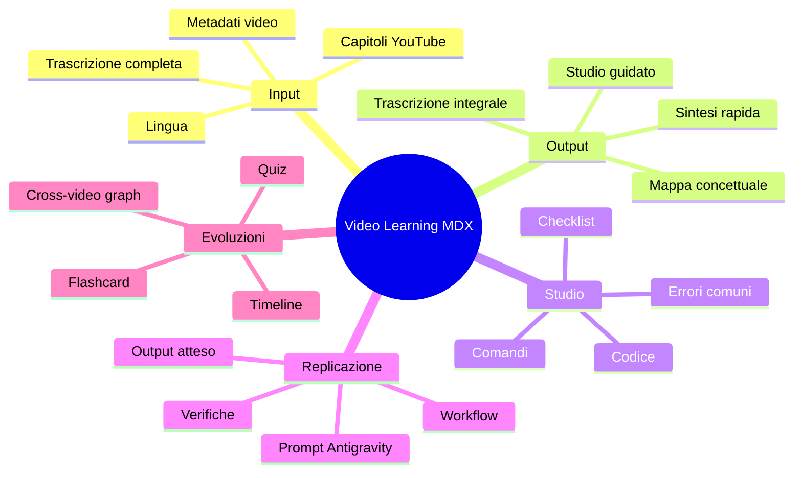

# Visione del plugin

Obiettivo: trasformare tutorial video, in particolare YouTube, in un file `MDX` progettato per apprendimento, ripasso e replicazione operativa.

## Output target

- `Modalità 1`: trascrizione integrale fedele, con capitoli e sottocapitoli.
- `Modalità 2`: studio guidato, con capitoli ottimizzati, checklist e istruzioni operative per Google Antigravity.
- `Modalità 3`: sintesi per capitolo, massimo 500 caratteri.
- `Mappa concettuale`: mermaid o mindmap.

## Mappa concettuale

## 25 proposte sì/no

- Vuoi una modalità `Sì/No` per includere screenshot automatici dei momenti chiave del video?
- Vuoi una modalità `Sì/No` per estrarre automaticamente tutti i link citati dal creator?
- Vuoi una modalità `Sì/No` per generare una checklist eseguibile passo-passo?
- Vuoi una modalità `Sì/No` per rilevare prerequisiti tecnici mancanti?
- Vuoi una modalità `Sì/No` per generare quiz finali a risposta multipla?
- Vuoi una modalità `Sì/No` per creare flashcard `domanda/risposta`?
- Vuoi una modalità `Sì/No` per salvare i timestamp cliccabili accanto a ogni capitolo?
- Vuoi una modalità `Sì/No` per distinguere teoria, pratica ed errori da evitare?
- Vuoi una modalità `Sì/No` per classificare i capitoli per difficoltà?
- Vuoi una modalità `Sì/No` per produrre una versione ultra-short da 1 minuto di lettura?
- Vuoi una modalità `Sì/No` per generare comandi terminale già ordinati per esecuzione?
- Vuoi una modalità `Sì/No` per ricostruire file e cartelle citati nel tutorial?
- Vuoi una modalità `Sì/No` per generare snippet separati per linguaggio (`bash`, `js`, `py`, `yaml`)?
- Vuoi una modalità `Sì/No` per evidenziare ciò che il creator dà per scontato?
- Vuoi una modalità `Sì/No` per aggiungere una sezione “errori probabili e fix”?
- Vuoi una modalità `Sì/No` per confrontare due video simili sullo stesso argomento?
- Vuoi una modalità `Sì/No` per unire più video in un unico syllabus?
- Vuoi una modalità `Sì/No` per generare un piano studio di 7 giorni?
- Vuoi una modalità `Sì/No` per generare task pronti per Notion o Todoist?
- Vuoi una modalità `Sì/No` per creare automaticamente tag tematici e skill map?
- Vuoi una modalità `Sì/No` per cercare duplicati rispetto ai video già studiati?
- Vuoi una modalità `Sì/No` per rilevare parti introduttive poco utili e comprimerle?
- Vuoi una modalità `Sì/No` per generare una rubrica di valutazione “ho capito / da rivedere / da praticare”?
- Vuoi una modalità `Sì/No` per creare una timeline delle azioni eseguite nel tutorial?
- Vuoi una modalità `Sì/No` per esportare anche un JSON strutturato oltre al file MDX?

## Scelte prodotto consigliate

- `Sì` a trascrizione integrale preservata localmente.
- `Sì` a file unico `MDX` con navigazione interna.
- `Sì` a istruzioni Antigravity concrete, non generiche.
- `Sì` a mappe concettuali `mermaid`.
- `Sì` a capitoli e sottocapitoli come unità base del learning design.
- `No` a componenti MDX custom obbligatori finché non esiste un renderer garantito.
- `No` a dipendenze backend obbligatorie nella prima iterazione.
